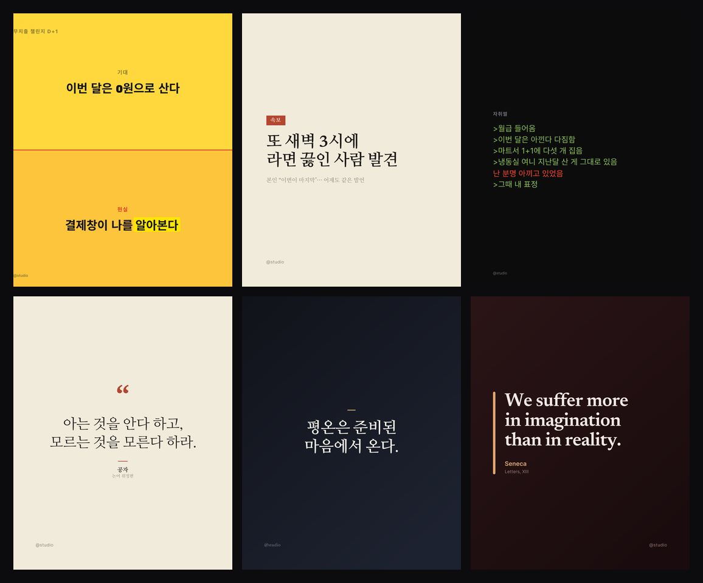
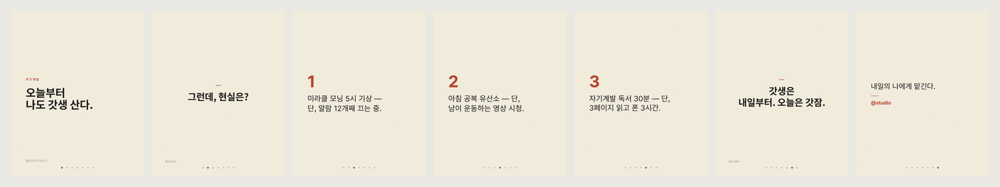

# 콘텐츠 엔진

한국어 SNS에 올릴 **글자 카드**랑 **캐러셀**을 만드는 도구.
텍스트만 넣으면 아래처럼 나옵니다.

## 이게 뭐냐

명언·인용부터 직장인 공감짤, 풍자, 밈까지 — 한 곳에서 카드나 캐러셀로 뽑습니다.
그림 모델한테 글자를 맡기지 않고 타이포를 직접 짜서, **글자가 안 깨지고 템플릿 느낌이 안 나는 게** 핵심.
결과물은 전부 PNG로 나오고, 인스타·틱톡·X 규격에 맞춰집니다.

## 이런 걸 만듭니다

- **기대 vs 현실 / 비교짤**
- **가짜 속보** (진지한 보도체로 사소한 걸 대문짝만하게)
- **음슴체 썰** — `>퇴근함 >치킨 시킴 …` 식 그린텍스트
- **명언·인용 카드** — 에디토리얼·모던·스위스 스타일
- **캐러셀** — 한 주제를 여러 장으로

캐러셀은 이렇게 나옵니다 (이상 vs 현실 예시):

## 고를 수 있는 것

- 포맷 11종 · 색 팔레트 9종 · 서체 6종 (임팩트 · 세리프 · 라운드 · 돋움 …)
- 배경: 단색 / 그라데이션 / 질감 / **내 사진 위에 얹기**
- 규격: 인스타 1:1·4:5, 스토리 9:16, X 16:9, 핀터레스트 2:3
- 단어 형광펜 강조, 글자 크기·색 직접 조절
- 올릴 때 쓸 **캡션·해시태그 자동 생성**

## 어디서 만드나

웹 에디터에서 종류 고르고 → 내용 쓰고 → 스타일 누르면 **실시간 미리보기**, 다운로드 누르면 끝.
패널은 좌측/하단으로 바꿀 수 있고, 스타일 변형·프리셋·저장함·명령줄 일괄 생성도 됩니다.
문구를 대신 써주는 AI 기능은 키를 넣으면 켜집니다(선택).

---

혼자 쓰려고 만든 개인 도구입니다. 렌더링은 Satori로 글자를 SVG로 그린 뒤 PNG로 합치는 방식이고, 서버는 Node 내장 http만 씁니다.
